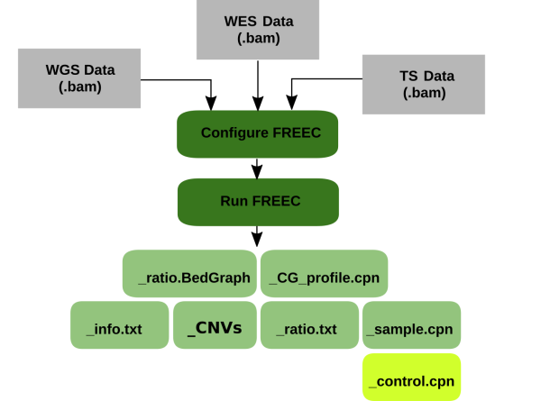

# freec

This Seqware workflow is a wrapper for [FREEC](http://boevalab.inf.ethz.ch/FREEC) which is a CNV analysis tool capable of making calls in the absence of control data (whole genome sequencing). The tool detects copy-number changes and allelic imbalances (including LOH) using deep-sequencing data. Nowdays, Control-FREEC is supported by the team of Valentina Boeva at Institut Cochin, Inserm (Paris).

Control-FREEC automatically computes, normalizes, segments copy number and beta allele frequency (BAF) profiles, then calls copy number alterations and LOH. The control (matched normal) sample is optional for whole genome sequencing data but mandatory for whole exome or targeted sequencing data. 



## Usage

## Cromwell

``` 
 java -jar cromwell.jar run freec.wdl --inputs inputs.json 
```

## Running Pipeline

```

 freec --conf config_freec.conf >> freec_run.log
 
```

The workflow will take a configuration file as its only input, this is generated on the fly depending on several parameters and available data. Embedded python script produces the configuration file. By default, data are analyzed using human hg19 reference assembly.

## Optional Assembly-specific Parameters:

hg19-specific data, for other assemblies these should be changed:

Paramter|Value
---|---
runFreec.modules | String? (optional, default = "freec/11.5 bedtools/2.27 samtools/0.1.19 hg19/p13")
runFreec.chrLenFile | String? (optional, default = "$HG19_ROOT/hg19_random.fa.fai")
runFreec.chrFiles | String? (optional, default = "$HG19_ROOT/")

## Other Parameters with default values:

These are parameters which may be tweaked to fine tune CNV calling:

Paramter|Value
---|---
outputFileNamePrefix | String? (optional, default = "")
bedgraphOutput | Boolean (optional, default = true)
runFreec.jobMemory | Int? (optional, default = 20)
runFreec.telocentromeric | Int? (optional, default = 50000 which is what authors suggest for human genome) 
runFreec.maxThreads | Int? (optional, default = 4)
runFreec.contaminationAdjustment | String? (optional, TRUE or FALSE. works with contaminationFraction)
runFreec.contaminationFraction | Float? (optional, shows the expected fraction of contaminating normal cells. default = 0.0) 
runFreec.logPath | String? (optional, name of log file. default = "freec_run.log")
runFreec.configFile | String? (optional, default = "config_freec.conf")
runFreec.coefficientOfVariation | Float? (optional, default = 0.05)
runFreec.timeout | Int (optional, default = 72)
runFreec.mateOrientation | String? (optional, default = "FR")
runFreec.ploidy | Int? (optional, default = 2)
runFreec.breakPointThreshold | Float? (optional, default = 0.8) 
runFreec.inputFormat | String? (optional, default = "BAM")
runFreec.window | Int? (optional, default = 1000)

## Required Inputs:

Paramter|Value
---|---
inputTumor | File This is a reuired input, bam file for sample (tumor)
inputNormal | File? (optional for WG, required for TS and EX) 
sequencingType | String, specifies which sequencing type it is (WG, ES, TS)
runFreec.intervalFile | File? (optional, needed only for EX and TS data)

## Outputs

```
  
  infoFile      *_info.txt        info file, parsable file with information about FREEC run
  regionFile    *_CNVs            file with coordinates of predicted copy number alterations.
  ratioFile     *_ratio.txt       file with ratios and predicted copy number alterations for each window
  cnvTumor      *_sample.cpn      file with raw copy number profiles
  cnvNormal     *_control.cpn     file with raw copy number profiles [Only when normal is supplied]
  gcProfile     *_CG_profile.cpn  file with GC-content profile
  ratioBedGraph *_ratio.BedGraph  file with ratios in BedGraph format for visualization in the UCSC genome browser

```
